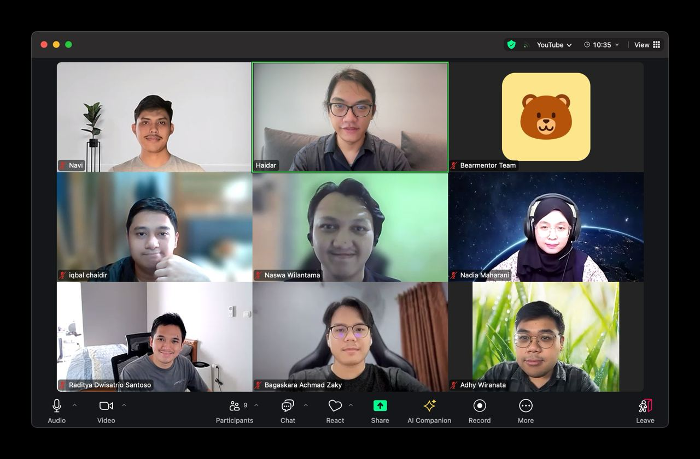

# Day 01 - Start, Introduction

## Learnings

- Overview of the bootcamp activities
- Device and software requirements
- Introduction session with participants and mentors

## Challenges

- Ensuring all participants have the necessary devices and software installed
- Developing fundamental essential soft skills and hard skills for engineering and practical implementation

## Tasks Completed

- Introduced myself along with other students and mentors, sharing our names, backgrounds, current occupations, and reasons for joining the bootcamp
- Understood the bootcamp learning process, which will start with fundamental topics and include monthly projects based on the topics covered
- Learned about the essential software tools and device requirements for the bootcamp

## Documentation

## Next Steps

- Ensure all participants, including myself, have their devices and software set up correctly
- Start working towards the first month's goal: mastering the fundamentals needed to create a personal website using essential languages such as:
  - Markdown
  - HTML
  - CSS
  - JavaScript, TypeScript, JSX
  - SQL
- Develop fundamental essential soft skills and hard skills:
  - **Fundamental essential soft skills**: English, communication, management, personal branding, profile/resume/CV, growth mindset, community, etc.
  - **Engineering hard skills**: logic, problem-solving, critical thinking, algorithm, data structure, system design, software architecture, etc.
  - **Practical implementation hard skills**: design, frontend, backend, full stack, library, framework, platform, services, etc.

## References

- [Day 01 - Start, Introduction](https://github.com/bearmentor-community/bearmentor-bootcamp/blob/main/days/day-01.md): Bearmentor Bootcamp Day 01
- [MDN Web Docs - Web Development Curriculum](https://developer.mozilla.org/en-US/curriculum/) : MDN Web Docs
- [Stack Overflow Developer Survey 2023](https://survey.stackoverflow.co/2023): Stack Overflow
