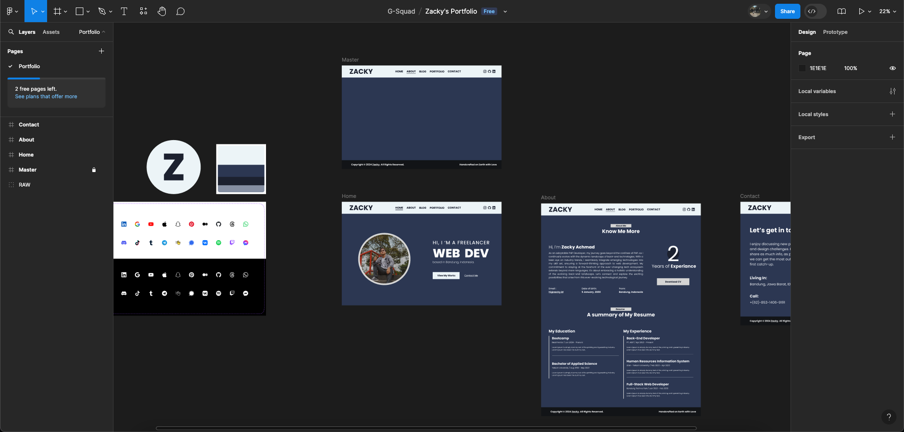

# Day 02 - Website vs Web App, UI/UX Design, Figma

## Learnings

- Understanding the distinction between a website and a web application (web app), where a website typically presents dynamic content such as text, video, audio, images, and animations, while a web app utilizes specific algorithms to dynamically change content on the same page at intervals, exemplified by platforms like Twitter using algorithms like 'foryou' to display relevant tweets on the home page.
- Exploring the principles of UI/UX design to create user interfaces that are not only visually appealing but also functional and user-friendly. Interface types include UI (User Interface), GUI (Graphical User Interface), CLI (Command-Line Interface), VUI (Voice-Controlled User Interface), and GBI (Gesture-Based User Interface).
- Introducing Figma, a web-based application for creating user interfaces, along with the stages of design: Sketch, wireframe, mockup, and prototype.
- Understanding design fidelity levels, including low fidelity (e.g., sketches, wireframes), medium fidelity (e.g., mockups), and high fidelity (e.g., interactive prototypes), and how they impact long-term application development.
- Exploring common design elements found in website layouts, such as navigation, logo, menu, search box, header, title, description, breadcrumb, content/sidebar, text, image, video, audio, footer, credit, sitemap, contact, map, and links.
- Identifying website structure elements, including layout, typography, images/photos, multimedia, interaction, buttons, form fields, control elements (e.g., toggles), and more based on the goal and context of the website.

## Challenges

- Applying the principles learned in UI/UX design to create user interfaces that are both visually appealing and functional.
- Mastering the use of Figma for designing user interfaces with varying levels of fidelity and complexity.
- Understanding how different design elements contribute to the overall structure and functionality of a website.

## Documentation

During the process of creating a mockup design for a personal website in the Figma application, several steps were followed:

### Color Palette Determination

- Defined a color palette consisting of primary and secondary colors that align with the personal branding and overall theme of the website. Considerations were made for color contrast, accessibility, and visual appeal.

### Layout and Pages Determination

- Decided on the layout and structure of the website, including the homepage, about page, portfolio page, contact page, and any additional pages deemed necessary. Each page's content and purpose were outlined to guide the design process effectively.

### Designing Individual Pages

- Utilizing Figma's tools and features, each page of the website was designed individually, focusing on creating visually engaging and functional user interfaces. Elements such as typography, imagery, navigation menus, buttons, and content sections were carefully placed and styled according to the established design principles and layout guidelines.

## Next Steps

- Begin practical exercises in Figma to create sketches, wireframes, mockups, and prototypes for various user interface designs.
- Explore additional resources and tutorials on UI/UX design principles to deepen understanding and skill mastery.
- Start implementing learned concepts in upcoming projects to enhance user experience and interface design.
