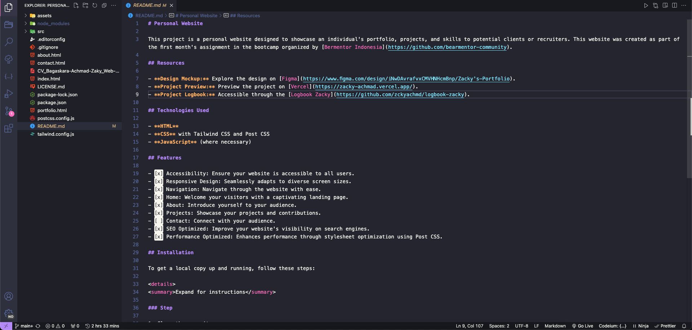

# Day 03 - Code Editor, Markdown

---

## Learnings

- Understanding the importance of device preparation for learning, including device specifications, operating system setup, and familiarity with keyboard layouts, characters, and symbols commonly used in coding.
- Introduction to code editors, starting with terminal-based text editors like nano, vim, vi, etc., and transitioning to Visual Studio Code (VSCode) for its user-friendly interface and extensive features, especially with extensions tailored for website development.
- Exploring the basics of Markdown, including its purpose, usage, and creating Markdown files for project READMEs, such as the first-month project, a personal website.

## Challenges

- Setting up the device with the appropriate specifications and operating system configurations.
- Mastering the features and functionalities of Visual Studio Code for efficient coding and website development.
- Understanding Markdown syntax and effectively utilizing it for project documentation.

## Documentation

During Day 03, the focus was on preparing the devices for learning, understanding code editors, and exploring Markdown for project documentation:

### Device Preparation

- Prepared devices by ensuring they meet the required specifications and have the necessary operating system setup.
- Introduced keyboard layouts and common characters/symbols used in coding to facilitate efficient coding practices.

### Code Editor: Visual Studio Code

- Recommended Visual Studio Code (VSCode) for its user-friendly interface and extensive features, especially with extensions tailored for website development.
- Explored the features and functionalities of VSCode to streamline the coding and development process

### Markdown Basics

- Introduced Markdown as a lightweight markup language used for formatting plain text, primarily for documentation purposes.
- Discussed the purpose and usage of Markdown, emphasizing its simplicity and versatility for creating project README files, documentation, and other text-based content.
- Created a Markdown file for the first-month project, a personal website, to demonstrate practical usage and familiarity with Markdown syntax.

## Next Steps

- Further familiarize with Visual Studio Code and its extensions, exploring advanced features for efficient coding and website development.
- Practice creating Markdown files for project documentation, refining skills in formatting and organizing content effectively.
- Begin implementing Markdown in project README files and documentation to enhance clarity and readability.

## References

- [Day 3, Code Editor, Markdown](https://github.com/bearmentor-community/bearmentor-bootcamp/blob/main/days/day-03.md) - Bearmentor Bootcamp Day 03
